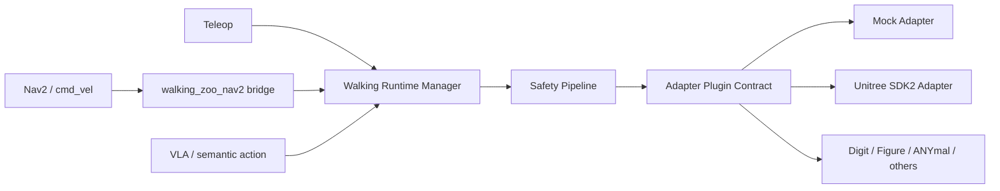

# walking_zoo

ROS2-native Walking Runtime & Adapter Hub for Humanoid and Legged Robots.

walking_zoo is not another locomotion policy repository. It is a ROS2-native
walking runtime layer for operating humanoid and legged robots in the real
world.

Think **Nav2 for walking robots**: Nav2 decides where a robot should go;
walking_zoo owns how walking commands are admitted, limited, dispatched, and
observed across robot-specific SDKs.


## Visual Tour

Run the same humanoid gait sequence locally with one launch command:
`ros2 launch walking_zoo_bringup mujoco_g1_gait_showcase.launch.py`.

Preview the humanoid target path with a Unitree G1 model rendered in MuJoCo as
a walking_zoo runtime target.


The gait gallery shows the command surface walking_zoo is designed to normalize:
forward walk, forward run, sidestep, and turn-in-place.


Send a Nav2-style velocity command and watch a Laikago robot rendered in
PyBullet move through the same runtime path without real hardware.


Trip the e-stop gate and the simulated robot stops before another adapter
command can pass through.


## Why walking_zoo?

Walking robots need a runtime layer, not just policies.

- `cmd_vel` alone is too thin for humanoids, quadrupeds, body pose control,
  footsteps, stand/sit modes, and fall handling.
- Robot SDKs are fragmented across Unitree, Digit, Figure, ANYmal, and other
  platforms.
- Learned policies and VLA systems still need a safe runtime boundary before
  they can operate real walking robots.
- walking_zoo provides the missing layer between Nav2, teleoperation, learned
  policies, future VLA systems, and vendor SDKs.

## What This Is Not

- Not an RL training repository.
- Not a simulator.
- Not a custom MPC, WBC, or gait research stack.
- Not a vendor-specific Unitree wrapper.
- Not a path around safety gates.

## Architecture



Core layers:

- `walking_zoo_msgs`: stable ROS2 msg/srv/action interfaces.
- `walking_zoo_core`: C++ adapter contract and shared types.
- `walking_zoo_safety`: velocity limiter, watchdog, estop gate.
- `walking_zoo_runtime`: lifecycle runtime, command dispatch, state publishing.
- `walking_zoo_mock_adapter`: always-buildable demo adapter.
- `walking_zoo_nav2`: `/cmd_vel` bridge for Nav2 integration.

## Quick Demo

Run a walking runtime without a real robot:

```bash
colcon build --symlink-install
source install/setup.bash
ros2 launch walking_zoo_bringup mock_runtime.launch.py
```

In another terminal:

```bash
source install/setup.bash
ros2 topic pub /cmd_vel geometry_msgs/msg/Twist "{linear: {x: 0.2}, angular: {z: 0.1}}" --once
ros2 topic echo /walking_zoo/state
```

Trigger the emergency stop gate:

```bash
ros2 service call /walking_zoo/estop walking_zoo_msgs/srv/EmergencyStop "{stop: true, reason: demo}"
```

Or run the end-to-end mock runtime check:

```bash
python3 tools/check_mock_runtime_e2e.py
```

## Live MuJoCo G1 Demo

Run a headless Unitree G1 gait visualizer that listens to walking_zoo ROS2
topics and writes `latest.png` plus `live.gif`:

```bash
colcon build --symlink-install
source install/setup.bash
python3 -m pip install -r tools/readme_gif_requirements.txt
git clone --depth 1 https://github.com/google-deepmind/mujoco_menagerie.git /tmp/walking_zoo_mujoco_menagerie
ros2 launch walking_zoo_bringup mujoco_g1_gait_demo.launch.py
```

Drive the demo through standard velocity commands:

```bash
ros2 topic pub /cmd_vel geometry_msgs/msg/Twist "{linear: {x: 0.25}, angular: {z: 0.0}}" --rate 10
```

Or switch gaits through semantic actions:

```bash
ros2 topic pub /walking_zoo/semantic_action walking_zoo_msgs/msg/SemanticAction "{action: 'sidestep_left'}" --once
ros2 topic pub /walking_zoo/semantic_action walking_zoo_msgs/msg/SemanticAction "{action: 'turn_right'}" --once
```

Open `/tmp/walking_zoo_mujoco_g1_demo/latest.png` or
`/tmp/walking_zoo_mujoco_g1_demo/live.gif` to inspect the current simulated
runtime target.

Run the one-command gait showcase to capture multiple walking styles:

```bash
ros2 launch walking_zoo_bringup mujoco_g1_gait_showcase.launch.py
```

The showcase automatically steps through forward walk, forward run, sidestep,
turn-in-place, stop, and the runtime e-stop gate. It writes
`/tmp/walking_zoo_mujoco_g1_showcase/latest.png` and `live.gif`.

Regenerate the README GIFs:

```bash
python3 -m venv /tmp/walking_zoo_gif_venv
/tmp/walking_zoo_gif_venv/bin/python -m pip install -r tools/readme_gif_requirements.txt
git clone --depth 1 https://github.com/google-deepmind/mujoco_menagerie.git /tmp/walking_zoo_mujoco_menagerie
/tmp/walking_zoo_gif_venv/bin/python tools/render_mujoco_g1_showcase_gif.py
/tmp/walking_zoo_gif_venv/bin/python tools/render_readme_gifs.py
python3 tools/check_mujoco_g1_showcase_assets.py
```

The README robot GIFs are rendered with MuJoCo and PyBullet using existing robot
assets. They are documentation assets, not a runtime dependency and not a new
simulator inside walking_zoo.

Expected behavior:

- The runtime autostarts as a lifecycle node.
- The mock adapter is loaded through pluginlib.
- `/cmd_vel` is converted to `/walking_zoo/cmd_vel`.
- Velocity commands pass through conservative safety limits.
- `/walking_zoo/state`, `/walking_zoo/adapter_status`, and
  `/walking_zoo/safety_state` are published.
- E-stop blocks further motion commands.

If Fast DDS shared-memory ports are stale on your machine, run the demo with a
clean domain or Cyclone DDS:

```bash
export RMW_IMPLEMENTATION=rmw_cyclonedds_cpp
export ROS_DOMAIN_ID=42
```

## Nav2 Integration

Phase 1 is intentionally simple:

```text
Nav2 controller -> /cmd_vel -> walking_zoo_nav2 -> /walking_zoo/cmd_vel
  -> WalkingRuntimeManager -> SafetyPipeline -> Adapter
```

walking_zoo complements Nav2. Nav2 handles global/local navigation, costmaps,
and recovery behavior. walking_zoo handles walking modes, safety gates, adapter
dispatch, and walking-specific commands.

## Adapter Contract

Robot support is added by implementing `walking_zoo_core::WalkingAdapter` and
exporting it as a pluginlib class. Adapter rules:

- Do not leak vendor SDK types into `walking_zoo_core` or `walking_zoo_msgs`.
- Keep real robot motion disabled by default.
- Require explicit `allow_motion:=true` before any real motion command.
- Return adapter health and robot state even when SDK connection fails.
- Put robot-specific capability differences in robot profiles.

## Safety First

All robot commands must pass through the safety pipeline before reaching an
adapter. v0.1 includes conservative velocity limiting, command timeout checks,
and an emergency stop gate. Fall detection and richer safety supervision are
planned interfaces, not hidden magic.

## Supported And Planned Robots

| Robot | Status | Notes |
| --- | --- | --- |
| Mock legged robot | Supported | Works out of the box, no hardware required. |
| Unitree Go2 | Profile + adapter skeleton | SDK2 integration is isolated and disabled by default. |
| Unitree G1 | Profile + adapter skeleton | Humanoid profile, conservative limits. |
| Unitree H1 | Profile + adapter skeleton | Humanoid profile, conservative limits. |
| Digit / Figure / Booster / Fourier / ANYmal | Planned | Add adapters through the common contract. |

## Roadmap

- v0.1: mock runtime, safety pipeline, Nav2 bridge, adapter contract.
- v0.2: richer lifecycle tooling, BT plugins, footstep visualization.
- v0.3: optional Unitree SDK2 implementation behind safe defaults.
- v0.4: footstep action execution and robot capability checks.
- v0.5: semantic action bridge for VLA systems and runtime log export design.

## Contributing

The highest-value contributions are adapter profiles, safety gates, Nav2
integration examples, and clear docs. Start with
[docs/adapter_contract.md](docs/adapter_contract.md) if you want to add robot
support.
