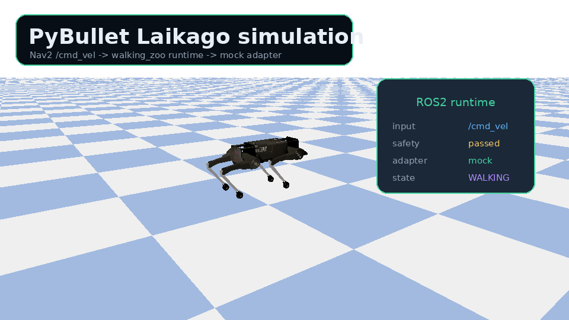
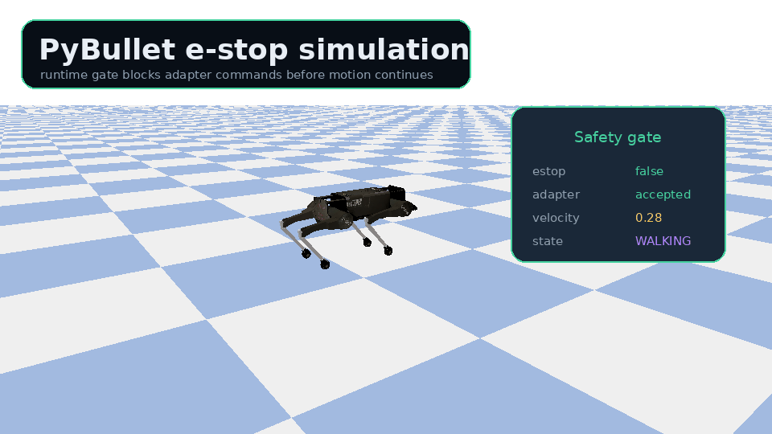
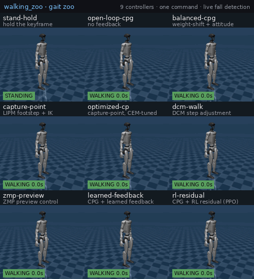
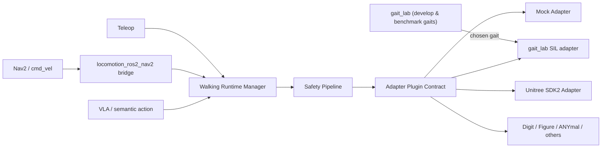

# locomotion_ros2

ROS2-native locomotion for humanoid and legged robots — from honest gait
benchmarks to safe, real-robot deployment.

locomotion_ros2 is two halves that meet in the middle:

- **The locomotion** — [`gait_lab`](experiments/gait_lab) benchmarks walking
  controllers honestly on real MuJoCo physics, where *bad gaits actually fall
  over*. Ten controllers (open-loop CPG, capture-point, a reactive capture-step
  push recovery, DCM step adjustment, ZMP preview, a PPO residual, a contact-QP
  whole-body controller, …) behind one interface, scored on the same Unitree G1
  with the same metrics — negatives reported.
- **The runtime** — a ROS2-native layer that takes a chosen gait and admits,
  limits, dispatches, and observes it safely across robot-specific SDKs. Think
  **Nav2 for walking robots**: Nav2 decides *where* a robot should go;
  locomotion_ros2 owns *how* the walking commands are admitted, limited,
  dispatched, and observed before they reach a robot.

The gait is the subject; the runtime is how it reaches a robot. A controller
validated in `gait_lab` drives a simulated Unitree G1 behind the real runtime
and safety pipeline — the experiment → product loop, wired end to end.


Want proof behind the GIF? See [Demo Evidence](docs/demo_evidence.md) for the
reproducible MuJoCo G1 runtime showcase, generated GIF, JSON trace, Markdown
timeline, and e-stop evidence.

## Visual Tour

Run the same humanoid gait sequence locally with one launch command:
`ros2 launch locomotion_ros2_bringup mujoco_g1_gait_showcase.launch.py`.

Preview the humanoid target path with a Unitree G1 model rendered in MuJoCo as
a locomotion_ros2 runtime target.


The gait gallery shows the command surface locomotion_ros2 is designed to normalize:
forward walk, forward run, reverse walk, sidestep, turn-in-place, and stand/stop.


Beyond locomotion, locomotion_ros2 also models body-pose commands (`MODE_BODY_POSE`):
a neutral stand next to body crouch, pitch, and roll holds.


Send a Nav2-style velocity command and watch a Laikago robot rendered in
PyBullet move through the same runtime path without real hardware.



Trip the e-stop gate and the simulated robot stops before another adapter
command can pass through.



## Why locomotion_ros2?

A locomotion controller is not enough on its own — and neither is a runtime.

- A gait that survives in a slide deck is not a gait that survives on physics.
  `gait_lab` makes the difference visible: same robot, same metrics, bad gaits
  fall over, and the negatives are reported.
- `cmd_vel` alone is too thin for humanoids, quadrupeds, body pose control,
  footsteps, stand/sit modes, and fall handling.
- Robot SDKs are fragmented across Unitree, Digit, Figure, ANYmal, and other
  platforms, and a learned or model-based gait still needs a safe boundary
  before it can move a real robot.
- locomotion_ros2 spans both ends: an honest place to *develop* a gait, and the
  ROS2 layer that *deploys* it between Nav2, teleoperation, VLA systems, and
  vendor SDKs.

## What This Is Not

- Not magic sim-to-real — `gait_lab` reports exactly where position-controlled
  gaits fall, and the runtime keeps real-robot motion off by default.
- Not its own simulator — `gait_lab` drives existing physics (MuJoCo) and robot
  model assets; the runtime is hardware- and simulator-free by default.
- Not a vendor-specific Unitree wrapper — the adapter contract is robot-agnostic.
- Not a path around safety gates — every command passes the safety pipeline.

## The Locomotion: gait_lab

[`gait_lab`](experiments/gait_lab) is where the gaits are developed and judged.
It drives a real MuJoCo Unitree G1 through physics (position actuators +
`mj_step`, not kinematic playback), puts every controller behind one small
`GaitController` interface, and scores them on the same robot with the same
metrics. A bad gait topples; a good one stays up and walks — apples-to-apples,
negatives included.



*Nine controllers, one command, the same G1 — live. `open-loop-cpg` topples in
~1 s; the kinematic footstep walkers (`capture-point`, `dcm-walk`,
`zmp-preview`) walk then fall; only `rl-residual` (CPG + a PPO residual) holds
the full horizon. That spread — who stays up, who walks farthest, who only looks
alive — is the honest benchmark this lab produces. It also maps the open
frontier precisely: clean steerable, push-robust walking needs to leave pure
position control for a force-aware (torque/ZMP) whole-body controller. See the
[gait_lab README](experiments/gait_lab/README.md) for the full story.*

A gait validated here does not stay in the lab: the
`locomotion_ros2_gait_lab_sil` adapter runs a chosen `gait_lab` controller as a
software-in-the-loop robot behind the real runtime and safety pipeline, so the
benchmark and the product share one gait.

### Run any benchmarked gait through the runtime

The SIL launch takes a `controller:=` argument, so any `gait_lab` controller can
be dispatched through the real runtime + safety pipeline — not just the default
`rl-residual`:

```bash
ros2 launch locomotion_ros2_bringup gait_lab_sil_runtime.launch.py controller:=dcm-walk
ros2 launch locomotion_ros2_bringup gait_lab_sil_runtime.launch.py controller:=capture-point
```

And the lab's honest benchmark reproduces *on the product path*. For each
controller, `check_gait_lab_sil_compare.py` brings up the runtime + SIL sim,
drives one velocity command through the safety pipeline, and scores the result
from `/locomotion_ros2/state` and the robot's base odometry — bad gaits still
actually fall over, now behind the runtime:

```bash
python3 tools/check_gait_lab_sil_compare.py --horizon 5
```

```
controller         forward   survival    minH  status
stand-hold         -0.000m     5.00s    0.79m  [stand]
open-loop-cpg      -0.009m     1.30s    0.08m  [FELL]
balanced-cpg       +0.469m     3.30s    0.08m  [FELL]
capture-point      +1.036m     1.90s    0.09m  [FELL]
capture-step       +0.000m     5.00s    0.79m  [stand]
dcm-walk           +1.094m     1.70s    0.08m  [FELL]
zmp-preview        +0.690m     3.40s    0.08m  [FELL]
rl-residual        +0.156m     5.00s    0.77m  [ok]
```

The footstep walkers walk farthest then topple in ~1–3 s; only `rl-residual`
survives the full horizon *and* walks — the same verdict as the bare
`gait_lab` harness, now produced through `/cmd_vel` → runtime → safety →
adapter → MuJoCo G1. (`capture-step` is a push-*recovery* controller — it holds a
stand rather than walking, so it stands here; its value shows up under a shove,
below.) The run writes `compare.json` and `compare.md` evidence.

The same tool benchmarks **push recovery** through the runtime — a mid-walk
base-velocity shove injected through the SIL sim's `gait_lab_sil/push` interface:

```bash
python3 tools/check_gait_lab_sil_compare.py \
    --controllers stand-hold capture-step dcm-walk rl-residual \
    --push-speed 0.4 --push-dir forward
```

```
# 0.4 m/s forward shove @ 1.0s
controller     forward   survival    minH  status
stand-hold     -0.898m     3.29s    0.04m  [FELL]
capture-step   +0.005m     5.00s    0.79m  [recovered]
dcm-walk       +1.384m     2.10s    0.07m  [FELL]
rl-residual    -0.487m     2.70s    0.08m  [FELL]
```

Under that shove `capture-step` is the **only** controller left standing
(`minH 0.79 m` — upright the full horizon); the held stand, the reactive footstep
walker, and the learned residual all topple. The recovery is the **decision to
step**: `capture-step` holds the standing keyframe until the capture point
`ξ = com + com_vel/ω` leaves the support polygon, then swings the falling-side
foot to it via the same position IK the footstep walkers use — N-step
capturability, realised through the runtime.

This is the actionable conclusion of the lab's force-aware frontier. The
contact-QP whole-body controller (`experiments/gait_lab/wbc_qp.py`) holds a quiet
stand with real friction-cone ground forces but goes **infeasible** the instant
the capture point leaves the support — it *certifies* "no in-place force recovers
this; you must step." `capture-step` is the controller that steps, promoted from a
standalone script to a registered `GaitController` so it runs behind the interface
and through the runtime. A strong-enough shove still topples it (capturability is
finite), and it does not yet *walk* while recovering — closing that gap is the
remaining force-aware work (a WBC that regulates a moving CoM/ZMP while stepping),
which the reusable `gait_lab_sil/push` interface benchmarks against.

## Architecture



Core layers:

- `experiments/gait_lab`: the locomotion — honest, physics-based gait benchmarks.
- `locomotion_ros2_msgs`: stable ROS2 msg/srv/action interfaces.
- `locomotion_ros2_core`: C++ adapter contract and shared types.
- `locomotion_ros2_safety`: velocity limiter, watchdog, estop gate.
- `locomotion_ros2_runtime`: lifecycle runtime, command dispatch, state publishing.
- `locomotion_ros2_mock_adapter`: always-buildable demo adapter.
- `locomotion_ros2_gait_lab_sil`: runs a `gait_lab` gait behind the runtime (SIL).
- `locomotion_ros2_nav2`: `/cmd_vel` bridge for Nav2 integration.

## Quick Demo

Run a walking runtime without a real robot:

```bash
colcon build --symlink-install
source install/setup.bash
ros2 launch locomotion_ros2_bringup mock_runtime.launch.py
```

In another terminal:

```bash
source install/setup.bash
ros2 topic pub /cmd_vel geometry_msgs/msg/Twist "{linear: {x: 0.2}, angular: {z: 0.1}}" --once
ros2 topic echo /locomotion_ros2/state
```

Trigger the emergency stop gate:

```bash
ros2 service call /locomotion_ros2/estop locomotion_ros2_msgs/srv/EmergencyStop "{stop: true, reason: demo}"
```

Or run the end-to-end mock runtime check:

```bash
python3 tools/check_mock_runtime_e2e.py
```

## Live MuJoCo G1 Demo

Run a headless Unitree G1 gait visualizer that listens to locomotion_ros2 ROS2
topics and writes `latest.png` plus `live.gif`:

```bash
colcon build --symlink-install
source install/setup.bash
python3 -m pip install -r tools/readme_gif_requirements.txt
git clone --depth 1 https://github.com/google-deepmind/mujoco_menagerie.git /tmp/locomotion_ros2_mujoco_menagerie
ros2 launch locomotion_ros2_bringup mujoco_g1_gait_demo.launch.py
```

Drive the demo through standard velocity commands:

```bash
ros2 topic pub /cmd_vel geometry_msgs/msg/Twist "{linear: {x: 0.25}, angular: {z: 0.0}}" --rate 10
```

Or switch gaits through semantic actions:

```bash
ros2 topic pub /locomotion_ros2/semantic_action locomotion_ros2_msgs/msg/SemanticAction "{action: 'walk_backward'}" --once
ros2 topic pub /locomotion_ros2/semantic_action locomotion_ros2_msgs/msg/SemanticAction "{action: 'sidestep_left'}" --once
ros2 topic pub /locomotion_ros2/semantic_action locomotion_ros2_msgs/msg/SemanticAction "{action: 'turn_right'}" --once
```

Or hold a body pose (`MODE_BODY_POSE`) instead of locomotion:

```bash
ros2 topic pub /locomotion_ros2/semantic_action locomotion_ros2_msgs/msg/SemanticAction "{action: 'body_crouch'}" --once
ros2 topic pub /locomotion_ros2/semantic_action locomotion_ros2_msgs/msg/SemanticAction "{action: 'body_pitch'}" --once
ros2 topic pub /locomotion_ros2/semantic_action locomotion_ros2_msgs/msg/SemanticAction "{action: 'body_roll'}" --once
```

The demo can also render a fall-detected placeholder state (the
`locomotion_ros2_safety` `FallDetector` flags it from body tilt, and recovery stays
blocked by the safety gate):

```bash
ros2 topic pub /locomotion_ros2/semantic_action locomotion_ros2_msgs/msg/SemanticAction "{action: 'fall_detected'}" --once
```

Open `/tmp/locomotion_ros2_mujoco_g1_demo/latest.png` or
`/tmp/locomotion_ros2_mujoco_g1_demo/live.gif` to inspect the current simulated
runtime target.

Run the one-command gait showcase to capture multiple walking styles:

```bash
ros2 launch locomotion_ros2_bringup mujoco_g1_gait_showcase.launch.py
```

The showcase automatically steps through forward walk, forward run, reverse
walk, sidestep, turn-in-place, stop, and the runtime e-stop gate. It writes
`/tmp/locomotion_ros2_mujoco_g1_showcase/latest.png` and `live.gif`.

Run the runtime proof version to capture the GIF plus ROS2 topic trace:

```bash
ros2 launch locomotion_ros2_bringup mujoco_g1_runtime_showcase.launch.py
python3 tools/check_demo_trace.py /tmp/locomotion_ros2_mujoco_g1_runtime_showcase/demo_trace.json --require-estop
```

This writes `latest.png`, `live.gif`, `demo_trace.json`, and `demo_trace.md`.
The trace records `/locomotion_ros2/state`, `/locomotion_ros2/adapter_status`,
`/locomotion_ros2/safety_state`, `/cmd_vel`, `/locomotion_ros2/cmd_vel`, and
`/locomotion_ros2/semantic_action`.

Each gait in the GIF maps to a concrete command path. The
[command-to-visual traceability table](docs/demo_evidence.md#command-to-visual-traceability)
shows how every showcase action flows from semantic intent through `/cmd_vel`,
the Nav2 bridge, the runtime state, and the rendered gait — including the new
`walk_backward` reverse gait.

See [examples/mujoco_g1_runtime_showcase](examples/mujoco_g1_runtime_showcase)
for the short example guide.

## Footstep Plan Preview

Humanoids need more than `/cmd_vel`. locomotion_ros2 ships a deterministic stub
footstep planner and an RViz marker preview so the footstep interface is visible
before any real footstep controller exists:

```bash
ros2 launch locomotion_ros2_runtime footstep_markers.launch.py step_count:=6 lateral_shift:=0.0
```

This publishes a `locomotion_ros2_msgs/FootstepPlan` on `/locomotion_ros2/footstep_plan`
and matching `visualization_msgs/MarkerArray` foot markers on
`/locomotion_ros2/footstep_markers` (add a `MarkerArray` display in RViz with the
fixed frame set to `base_link`). Left and right feet are colored blue and green,
and any step the placeholder feasibility check rejects (over-long stride, too far
lateral, or too high a swing) turns red. Try `lateral_shift:=0.3` to push later
steps out of range and see them flagged.

The runtime itself accepts footstep plans through the `ExecuteFootstepPlan`
action on `/locomotion_ros2/execute_footstep_plan`. The runtime runs the same
feasibility gate before dispatching the plan to the adapter, publishes per-step
feedback, and aborts infeasible plans instead of executing them. End-to-end:

```bash
python3 tools/check_footstep_action_e2e.py
```

This launches the mock runtime, executes a feasible plan, and confirms an
infeasible plan is rejected. The stub planner does not command real motion or
check terrain; it is a placeholder for a real footstep controller.

Regenerate the README GIFs:

```bash
python3 -m venv /tmp/locomotion_ros2_gif_venv
/tmp/locomotion_ros2_gif_venv/bin/python -m pip install -r tools/readme_gif_requirements.txt
git clone --depth 1 https://github.com/google-deepmind/mujoco_menagerie.git /tmp/locomotion_ros2_mujoco_menagerie
/tmp/locomotion_ros2_gif_venv/bin/python tools/render_mujoco_g1_showcase_gif.py
/tmp/locomotion_ros2_gif_venv/bin/python tools/render_readme_gifs.py
python3 tools/check_mujoco_g1_showcase_assets.py
```

The README robot GIFs are rendered with MuJoCo and PyBullet using existing robot
assets. They are documentation assets, not a runtime dependency and not a new
simulator inside locomotion_ros2.

Expected behavior:

- The runtime autostarts as a lifecycle node.
- The mock adapter is loaded through pluginlib.
- `/cmd_vel` is converted to `/locomotion_ros2/cmd_vel`.
- Velocity commands pass through conservative safety limits.
- `/locomotion_ros2/state`, `/locomotion_ros2/adapter_status`, and
  `/locomotion_ros2/safety_state` are published.
- E-stop blocks further motion commands.

If Fast DDS shared-memory ports are stale on your machine, run the demo with a
clean domain or Cyclone DDS:

```bash
export RMW_IMPLEMENTATION=rmw_cyclonedds_cpp
export ROS_DOMAIN_ID=42
```

## Nav2 Integration

Phase 1 is intentionally simple:

```text
Nav2 controller -> /cmd_vel -> locomotion_ros2_nav2 -> /locomotion_ros2/cmd_vel
  -> WalkingRuntimeManager -> SafetyPipeline -> Adapter
```

locomotion_ros2 complements Nav2. Nav2 handles global/local navigation, costmaps,
and recovery behavior. locomotion_ros2 handles walking modes, safety gates, adapter
dispatch, and walking-specific commands.

## Adapter Contract

Robot support is added by implementing `locomotion_ros2_core::WalkingAdapter` and
exporting it as a pluginlib class. Adapter rules:

- Do not leak vendor SDK types into `locomotion_ros2_core` or `locomotion_ros2_msgs`.
- Keep real robot motion disabled by default.
- Require explicit `allow_motion:=true` before any real motion command.
- Return adapter health and robot state even when SDK connection fails.
- Put robot-specific capability differences in robot profiles.

## Safety First

All robot commands must pass through the safety pipeline before reaching an
adapter. v0.1 includes conservative velocity limiting, command timeout checks,
and an emergency stop gate. Fall detection and richer safety supervision are
planned interfaces, not hidden magic.

## Supported And Planned Robots

| Robot | Status | Notes |
| --- | --- | --- |
| Mock legged robot | Supported | Works out of the box, no hardware required. |
| Unitree Go2 | Profile + adapter skeleton | SDK2 integration is isolated and disabled by default. |
| Unitree G1 | Profile + adapter skeleton | Humanoid profile, conservative limits. |
| Unitree H1 | Profile + adapter skeleton | Humanoid profile, conservative limits. |
| Digit / Figure / Booster / Fourier / ANYmal | Planned | Add adapters through the common contract. |

## Roadmap

- v0.1: mock runtime, safety pipeline, Nav2 bridge, adapter contract.
- v0.2: richer lifecycle tooling, BT plugins, footstep visualization.
- v0.3: optional Unitree SDK2 implementation behind safe defaults.
- v0.4: footstep action execution and robot capability checks.
- v0.5: semantic action bridge for VLA systems and runtime log export design.

## Contributing

The highest-value contributions are adapter profiles, safety gates, Nav2
integration examples, and clear docs. Start with
[docs/adapter_contract.md](docs/adapter_contract.md) if you want to add robot
support.
