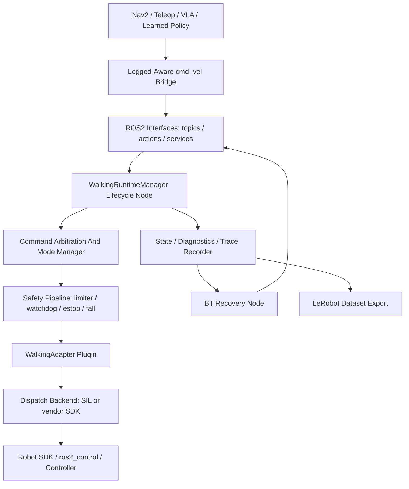

# Architecture

walking_zoo is a ROS2-native walking runtime, not a policy zoo. It provides the
runtime boundary between high-level command sources and robot-specific walking
SDKs.

`walking_zoo_bringup` launches the runtime with a real robot profile YAML even
for the mock adapter. This keeps the demo path aligned with production adapter
configuration instead of relying on hard-coded defaults.

## Layers

- Interface layer: `walking_zoo_msgs` (topics, the `ExecuteFootstepPlan` /
  `ExecuteBodyPose` actions, and the `EmergencyStop` / `ClearFault` /
  `SetLocomotionMode` services) plus standard ROS2 messages.
- Runtime layer: `WalkingRuntimeManager` lifecycle node — command ingress, the
  footstep/body-pose action servers, mode management, and state publication.
- Safety layer: velocity limiter, watchdog, estop gate, `FallDetector`, and the
  body-pose / footstep feasibility gates.
- Adapter layer: pluginlib `WalkingAdapter` contract hiding vendor SDKs. Adapters
  dispatch through a backend boundary (e.g. the Unitree adapter's
  `UnitreeLocoBackend` — a software-in-the-loop backend by default, the vendor
  `LocoClient` when built with the SDK).
- Planning layer: deterministic, terrain-aware `FootstepPlanner` (keep-out
  avoidance and curb step-up) feeding the footstep markers and action.
- Integration layer: legged-aware Nav2 `cmd_vel` bridge, a live BehaviorTree.CPP
  recovery node (`walking_zoo_bt_recovery_node`), the VLA semantic-action mapper,
  and a LeRobot dataset exporter for runtime traces.

## Recovery And Fault Handling

The estop and fault paths are deliberately layered. The runtime owns the
operator-estop interlock: a fault may not be cleared while the runtime estop is
engaged. The adapter owns driver re-enable: its `clear_fault` clears the driver
fault and releases the estop latch. The BehaviorTree recovery node closes the
loop — it watches `/walking_zoo/state`, and when the robot is not ready it calls
`/walking_zoo/clear_fault` to bring the robot back, but it can never override an
engaged operator estop.

## Runtime Boundary

Nav2 owns path planning and obstacle-aware navigation. walking_zoo owns walking
command execution, robot mode, safety gates, and adapter dispatch.
