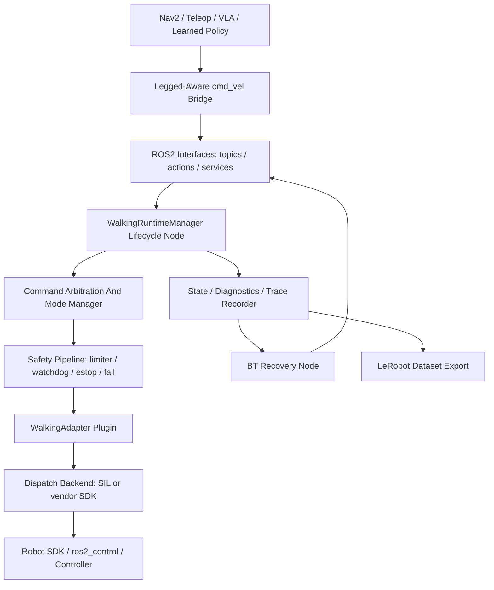

# Architecture

locomotion_ros2 is a ROS2-native walking runtime, not a policy zoo. It provides the
runtime boundary between high-level command sources and robot-specific walking
SDKs.

`locomotion_ros2_bringup` launches the runtime with a real robot profile YAML even
for the mock adapter. This keeps the demo path aligned with production adapter
configuration instead of relying on hard-coded defaults.

## Layers

- Interface layer: `locomotion_ros2_msgs` (topics, the `ExecuteFootstepPlan` /
  `ExecuteBodyPose` actions, and the `EmergencyStop` / `ClearFault` /
  `SetLocomotionMode` services) plus standard ROS2 messages.
- Runtime layer: `WalkingRuntimeManager` lifecycle node — command ingress, the
  footstep/body-pose action servers, mode management, and state publication.
- Safety layer: velocity limiter, watchdog, estop gate, `FallDetector`, and the
  body-pose / footstep feasibility gates.
- Adapter layer: pluginlib `WalkingAdapter` contract hiding vendor SDKs. Adapters
  dispatch through a backend boundary, validated across robot classes: the
  Unitree G1 humanoid (`UnitreeLocoBackend` → `LocoClient`) and the Unitree Go2
  quadruped (`Go2SportBackend` → `SportClient`), each a software-in-the-loop
  backend by default and the vendor client when built with the SDK. The Go2
  models a genuinely quadruped FSM (lie-down rest, recovery-stand, sit on quick
  stop, four-foot support).
- Planning layer: deterministic, terrain-aware `FootstepPlanner` (keep-out
  avoidance and curb step-up) feeding the footstep markers and action. Terrain
  comes from a real source: a Nav2-style `nav_msgs/OccupancyGrid` costmap drives
  the keep-out cells and an optional elevation grid drives step-up heights
  (`TerrainModel` grid queries), with hand-authored boxes still available for
  tests and hardware-free demos.
- Integration layer: legged-aware Nav2 `cmd_vel` bridge, a live BehaviorTree.CPP
  recovery node (`locomotion_ros2_bt_recovery_node`), the VLA semantic-action mapper,
  and a LeRobot dataset exporter for runtime traces.

## Recovery And Fault Handling

The estop and fault paths are deliberately layered. The runtime owns the
operator-estop interlock: a fault may not be cleared while the runtime estop is
engaged. The adapter owns driver re-enable: its `clear_fault` clears the driver
fault and releases the estop latch. The BehaviorTree recovery node closes the
loop — it watches `/locomotion_ros2/state`, and when the robot is not ready it calls
`/locomotion_ros2/clear_fault` to bring the robot back, but it can never override an
engaged operator estop.

The same recovery is also packaged as Nav2 bt_navigator plugins
(`locomotion_ros2_nav2_bt_nodes`: `IsWalkingReady` + `ClearWalkingFault`, the latter
built on `nav2_behavior_tree::BtServiceNode`) so the walking fault recovery can
run inside a real Nav2 navigate-to-pose recovery branch
(`navigate_to_pose_w_walking_recovery.xml`) rather than only as a standalone
node. The operator-estop interlock still holds through that path.

## Runtime Boundary

Nav2 owns path planning and obstacle-aware navigation. locomotion_ros2 owns walking
command execution, robot mode, safety gates, and adapter dispatch.

## Gait Algorithms Are A Command Source, Not The Runtime

locomotion_ros2 is not a gait research stack — gait generation sits *outside* the
runtime boundary as just another command source behind a stable interface. To
make that concrete (and answer "can I actually try gait algorithms here?"),
`experiments/gait_lab/` is a physics-driven testbed: it drives a real MuJoCo
Unitree G1 through `mj_step` and compares pluggable `GaitController`
implementations (open-loop CPG vs. balance-feedback CPG vs. a standing baseline)
on the same robot with the same metrics. It lives under `experiments/` because
it depends on MuJoCo and a model checkout the hardware-free ROS 2 build must not
require; the intended bridge back is to expose a validated controller as a
locomotion_ros2 adapter so a gait proven there drives the real runtime/safety
pipeline. See `experiments/gait_lab/README.md`.
