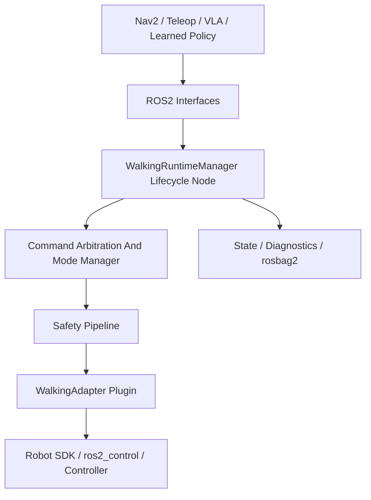

# Architecture

walking_zoo is a ROS2-native walking runtime, not a policy zoo. It provides the
runtime boundary between high-level command sources and robot-specific walking
SDKs.

The first implementation focuses on a mock adapter, conservative velocity
commands, lifecycle startup, adapter dispatch, and state publication. Future
versions add richer footstep, body pose, and semantic action execution.

`walking_zoo_bringup` launches the runtime with a real robot profile YAML even
for the mock adapter. This keeps the demo path aligned with production adapter
configuration instead of relying on hard-coded defaults.

## Layers

- Interface layer: `walking_zoo_msgs` plus standard ROS2 messages.
- Runtime layer: lifecycle node, command ingress, state publication, action
  server skeletons.
- Safety layer: velocity limiter, watchdog, estop gate, future fall detector.
- Adapter layer: pluginlib contract hiding vendor SDKs.
- Integration layer: Nav2 bridge, BT skeletons, future VLA mapper.

## Runtime Boundary

Nav2 owns path planning and obstacle-aware navigation. walking_zoo owns walking
command execution, robot mode, safety gates, and adapter dispatch.
