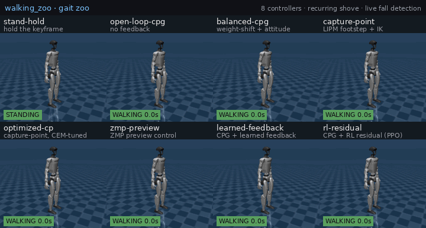
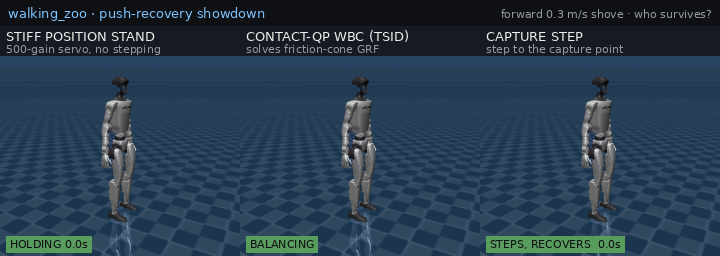
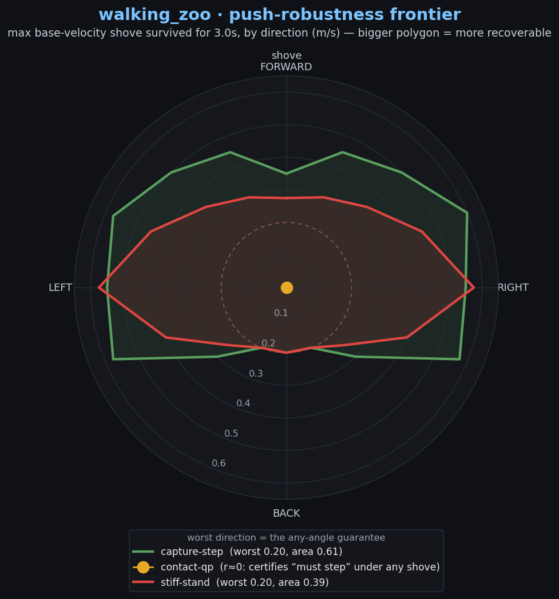
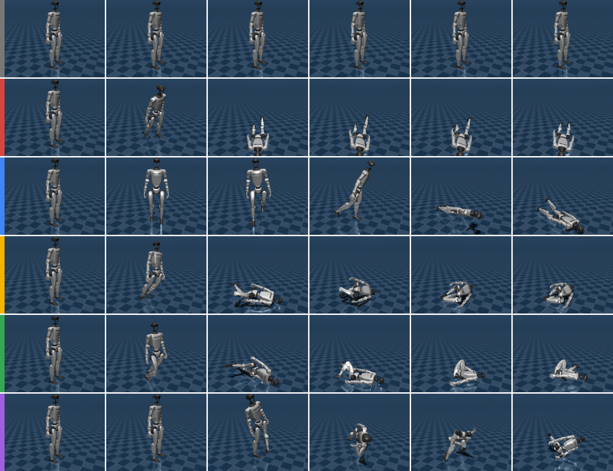

# gait_lab — honest physics benchmarks for walking gait algorithms

**Bad gaits actually fall over here.** `gait_lab` drives a real MuJoCo **Unitree G1**
through physics (position actuators + `mj_step`, not kinematic playback), puts every
walking controller behind one small interface, and scores them on the same robot with
the same metrics. A bad gait topples; a good one stays up and walks — apples-to-apples,
and the negatives are reported (the whole point: see the textbook whole-body controller
*lose*, below).

It lives *alongside* the walking_zoo runtime (the runtime/safety/adapter layer for
walking robots) as the research playground for the controllers that runtime dispatches:
the interface here is `GaitController` and the "runtime" is the physics harness.


*Nine controllers, one command, the same MuJoCo G1 — live. The status chip flips
red the instant a gait falls: `open-loop-cpg` topples in ~1 s, the kinematic
footstep walkers (`capture-point`, `optimized-cp`, `dcm-walk`, `zmp-preview`) walk
then fall, and only `rl-residual` (CPG + a PPO residual) holds the full horizon. That spread
— who stays up, who walks farthest, who only looks alive — is the honest benchmark
this lab exists to produce. Regenerate with `MUJOCO_GL=egl python3 render_zoo_gif.py`
(add `--push 0.6` for the push-recovery cut).*



*The same zoo under a recurring 0.6 m/s shove. Now **every** stand-and-walk
controller topples — fastest first (`open-loop-cpg`, `capture-point` at ~1 s), the
stiff stand and the RL walker last longest but still go down (~3–4 s). That is the
lab's central finding made visible: regulating a stand cannot survive a real push,
no matter the controller — the one move that recovers is to **step** (see
`capture_step.py`, and the contact-QP WBC in `wbc_qp.py` that *certifies* "you must
step" by going infeasible). Regenerate with `--push 0.6`.*



*The answer, in one shot. Three controllers, the same forward 0.3 m/s shove. The
**stiff position stand** (the 500-gain servo that wins every other comparison)
topples. The **contact-QP WBC** goes infeasible the instant the capture point exits
the support polygon — a *certificate*, "you must step," not a crash. The **capture
step** listens to exactly that certificate, steps to the capture point, and holds the
full horizon. The one move that survives a real push is stepping, taken when the QP
says you must — the through-line of the whole lab in a single loop. Each tile is the
unmodified, tested rollout with `model.step` wrapped to record frames. Regenerate with
`MUJOCO_GL=egl python3 render_showdown.py`.*



*The showdown is one push from one angle; this is the **whole map**. For each
controller and every shove direction, `push_frontier.py` binary-searches the largest
base-velocity kick (m/s) it survives for the full horizon — a *robustness polygon* in
velocity space. The shape is the recovery anisotropy: both polygons bulge sideways
(the G1's wide stance) and pinch fore-aft (the narrow ankle-pitch axis). The
**capture step** (green) encloses the **stiff stand** (red) almost everywhere — **+55 %
recoverable area** — but they tie at the backward worst case (~0.2 m/s): stepping
widens the frontier where it can reach, and honestly does not where it can't. The
**contact-QP** collapses to the dot at the origin: it holds a quiet stand but certifies
"must step" under *any* shove, so its in-place frontier has zero width. Regenerate the
numbers with `python3 push_frontier.py` and the plot with `python3 render_frontier.py`.*

## Quickstart

No GPU needed for the numbers; a GL backend (`MUJOCO_GL=egl`) is only for the GIFs.

```bash
pip install mujoco numpy scipy pillow imageio matplotlib
git clone https://github.com/google-deepmind/mujoco_menagerie.git /tmp/walking_zoo_mujoco_menagerie
cd experiments/gait_lab

python3 run_compare.py                      # the honest benchmark table (no GL)
MUJOCO_GL=egl python3 render_zoo_gif.py     # regenerate the gait-zoo GIF above
```

`run_compare.py` rolls every controller out on the same robot and prints survival,
forward distance and speed, then names the farthest walker, the most stable, and the
only one that survives *and* walks:

```
algorithm           forward     speed       survival  status
open-loop-cpg      fwd=+0.100m  speed=+0.130m/s  survive= 1.07s  [FELL]
optimized-cp       fwd=+1.250m  speed=+1.228m/s  survive= 1.32s  [FELL]
rl-residual        fwd=+0.168m  speed=+0.036m/s  survive= 5.00s  [ok]
...
farthest walker: optimized-cp (+1.250 m, survived 1.32s)
survives & walks: rl-residual (+0.168 m over the full 5.00s)
```



*Same robot, same 6 s, one row per algorithm (time runs left→right). Top to
bottom by the left colour bar: **grey** `stand-hold` (stays upright, goes
nowhere), **red** `open-loop-cpg` (topples in ~1 s), **blue** `balanced-cpg`
(steps and stays up longest of the CPGs, ~3 s), **yellow** `capture-point` (walks
then falls), **green** `optimized-cp` (walks farthest, then falls), **purple**
`zmp-preview` (planned walking), **teal** `learned-feedback` (learned linear
feedback), **orange** `rl-residual` (the RL policy — the only gait still walking
at 6 s). Regenerate with `MUJOCO_GL=egl python3 render_montage.py --horizon 6`.*

## What's included

Nine algorithms spanning seven classes (CPG, reactive model-based, optimised,
DCM closed-loop, preview model-based, learned-linear, **reinforcement-learned**):

| algorithm          | idea                                                          |
|--------------------|---------------------------------------------------------------|
| `stand-hold`       | hold the standing keyframe (baseline: stable, goes nowhere)   |
| `open-loop-cpg`    | fixed sinusoidal stepping, **no feedback** (the honest failure) |
| `balanced-cpg`     | stepping + lateral weight-shift + torso-attitude feedback     |
| `capture-point`    | LIPM capture-point footstep placement + leg **inverse kinematics** |
| `optimized-cp`     | the capture-point gait with parameters found by **optimisation** (CEM), not by hand |
| `dcm-walk`         | **DCM step adjustment** — nominal footstep plan + a continuous closed-loop divergent-component foot-placement correction |
| `zmp-preview`      | **ZMP preview control** (Kajita) plans a CoM trajectory tracked via IK |
| `learned-feedback` | CPG feedforward + a **learned** linear feedback policy (CEM-trained) |
| `rl-residual`      | CPG feedforward + a **reinforcement-learned** neural residual (PPO) — the only gait that walks the full horizon |

A representative run (`run_compare.py`, 8 s horizon):

```
algorithm           forward     speed       survival  drift     minH   status
stand-hold         fwd=-0.000m  speed=-0.000m/s  survive= 8.00s  drift=0.000m  minH=0.79m  [ok]
open-loop-cpg      fwd=+0.100m  speed=+0.130m/s  survive= 1.07s  drift=0.168m  minH=0.50m  [FELL]
balanced-cpg       fwd=+0.269m  speed=+0.096m/s  survive= 3.09s  drift=0.267m  minH=0.50m  [FELL]
capture-point      fwd=+0.614m  speed=+0.814m/s  survive= 1.05s  drift=0.038m  minH=0.50m  [FELL]
optimized-cp       fwd=+1.250m  speed=+1.228m/s  survive= 1.32s  drift=0.128m  minH=0.50m  [FELL]
dcm-walk           fwd=+0.814m  speed=+0.956m/s  survive= 1.15s  drift=0.061m  minH=0.50m  [FELL]
zmp-preview        fwd=+0.658m  speed=+0.310m/s  survive= 2.42s  drift=0.194m  minH=0.50m  [FELL]
learned-feedback   fwd=+0.740m  speed=+0.431m/s  survive= 2.02s  drift=0.100m  minH=0.50m  [FELL]
rl-residual        fwd=+0.728m  speed=+0.095m/s  survive= 8.00s  drift=0.158m  minH=0.77m  [ok]

farthest walker: optimized-cp (+1.250 m, survived 1.32s)
most stable:     stand-hold (survived 8.00s)
survives & walks: rl-residual (+0.728 m over the full 8.00s)
```

The story the numbers tell, and the reason a comparison testbed is worth having:

* **open-loop** stepping topples a humanoid in ~1 s — feedback is not optional.
* **balanced-cpg** (lateral weight-shift so the swing foot can unload + ankle
  attitude feedback) survives **~3× longer** and creeps forward: the *most
  stable* stepper.
* **capture-point** reasons about *where* to put the next foot — it models the
  robot as a linear inverted pendulum, places the swing foot at the
  instantaneous capture point (`xi = x_com + v_com/omega`) via leg IK, and walks
  **~6× farther and far straighter** (drift 0.04 m vs 0.17 m) than open-loop —
  the *farthest walker*. But it is the *least durable*: kinematic footstep
  placement commits to long strides without true dynamic (ZMP/force) balance, so
  it eventually topples.

* **optimized-cp** is the *same algorithm and interface* as `capture-point`,
  but its parameters were found by **optimisation** (`optimize.py`, a
  Cross-Entropy Method over physics rollouts) instead of by hand. It walks
  **~2× farther** than the hand-tuned version (1.25 m vs 0.61 m) — the testbed's
  concrete answer to "does an optimisation-based gait beat hand-tuning?". Note
  it optimised the *distance* objective: it does not out-*stabilise*
  `balanced-cpg`, because that is not what it was rewarded for. Optimisation
  closes the gap on the axis you optimise.
* **dcm-walk** is the modern textbook *closed-loop* walker the other two leave a
  gap for. `capture-point` reasons about the foothold only at each foot strike;
  `zmp-preview` plans the whole trajectory open-loop and never feeds the measured
  state back. This does both: a nominal footstep plan (so it bootstraps and marches
  straight) **plus** a **DCM** (divergent-component-of-motion) correction recomputed
  *every control tick*, placing the next foot proportional to the CoM velocity error
  `k·(v - v_nom)/omega` — the unstable mode you must step on. It walks the
  **second-farthest** of all the steppers (0.81 m, behind only the CEM-optimised one)
  and very straight (drift 0.06 m). **But the honest result is a null one:** on this
  *position-controlled* G1 the closed loop buys **no** survival — it topples at 1.15 s
  like every footstep walker, and the *open-loop* `zmp-preview` actually outlives it
  (2.42 s). The full DCM law needs to track a reference Centre-of-Pressure *within*
  each step, which needs **torque/force authority** the position servos don't give;
  without it, the predictive propagation diverges from a cold stand and the realizable
  law is just velocity-error step placement. The theory's robustness edge is real, but
  it cashes out only with force-aware control — the lab's recurring ceiling, found
  again from a new direction.
* **zmp-preview** is the most *principled* model-based walker: it plans a whole
  CoM trajectory up front with **Kajita preview control** (a cart-table LIPM
  whose induced ZMP tracks — and leads — the footstep reference), then realises
  it via IK. It is the best all-rounder among the steppers: it walks farther
  than `balanced-cpg` *and* survives longer than the reactive `capture-point`,
  because planning ahead lets the CoM sway over the next stance foot *before*
  the step instead of reacting after.
* **learned-feedback** keeps the CPG feedforward but replaces the hand-tuned
  ankle gains with a **learned** linear feedback policy (`residual = W @ obs`,
  `W` trained by CEM, `train_policy.py`). It walks **~2.7× farther** than
  `balanced-cpg` (0.74 m vs 0.27 m) and far straighter (drift 0.10 m), but does
  *not* out-survive it — learning the feedback buys distance, not a broken
  balance ceiling. See *Learning the feedback* below for the (important) caveat.
* **rl-residual** is the one that finally **breaks the ceiling**. Same CPG
  feedforward, but the correction is a *neural* policy trained by
  **reinforcement learning** (PPO, `train_rl.py`) instead of a linear map. It is
  the **only gait here that survives the full 8 s horizon** (`[ok]`, like
  `stand-hold`) *and* walks forward while doing so (0.73 m) — it never even
  approaches a fall (`minH` 0.77 m vs 0.50 m = fallen for every stepper). Where
  every hand-tuned, optimised, and linearly-learned gait tops out at the ~3 s
  lateral ceiling, the RL residual just keeps walking. See *Breaking the ceiling*
  below.

So there *is* a controller here that both walks and stays up — but only the
reinforcement-learned one. Every hand-designed, optimised, and linearly-learned
gait faces the same structural choice (*farthest walker* vs *most stable* are
different algorithms, and none of them survives the horizon); learning a
nonlinear closed-loop policy with full RL credit assignment is what it took to
have both at once. That gap, and what closes it, is exactly what the testbed
exists to surface — and every one of these drops in behind the same
`GaitController` interface.

## Optimising a gait

`optimize.py` searches a controller's `TUNABLES` parameter space with the
Cross-Entropy Method, scoring each candidate by a physics rollout (distance
walked, with a small survival term). It warm-starts at the hand-tuned defaults:

```bash
python3 optimize.py --iters 10 --pop 18 --seed 0   # ~a few minutes; deterministic
```

The discovered parameters are baked into `OptimizedCapturePoint`
(`controllers.OPTIMIZED_CAPTURE_POINT_PARAMS`) so the result is reproducible and
needs no optimiser at run time. A **learned policy** is the same shape: swap the
parameter/inference source behind the identical `GaitController` interface —
load weights in `reset`, run the network in `update`.

### Does optimisation close the "farthest vs. most stable" gap?

`optimize.py --objective` lets you reward different things:

```bash
python3 optimize.py --objective distance   # walk far (the default)
python3 optimize.py --objective balanced    # distance × fraction-of-horizon-survived
```

Tried both ways, the answer is a clean **no — not by tuning a reactive gait**.
Optimising `capture-point` for raw distance doubles it (→ 1.25 m) but it still
falls at ~1.3 s; optimising for *sustained* walking (the `balanced` objective,
which only rewards ground covered without falling) lands in the same place
(~1.3 m, ~1.5 s). Whatever the objective, the best capture-point parameters top
out around a **~1.5 s survival ceiling** — it is a *structural* limit of a
one-step-lookahead reactive gait, not a tuning problem. Optimisation reliably
improves the axis you reward, but it cannot make a reactive scheme balance like a
planning one. Closing the gap needs a better *algorithm* — `zmp-preview`'s
look-ahead already survives noticeably longer (2.4 s) — or a learned policy
behind this same interface.

## Learning the feedback (and a chaos caveat)

`train_policy.py` trains `learned-feedback`'s linear policy (`residual = W @ obs`,
mapping torso roll/pitch/rates and CoM velocity to ankle/hip corrections) with the
Cross-Entropy Method, warm-started from balanced-cpg-style ankle gains:

```bash
python3 train_policy.py --seeds 3 --iters 14   # robust CEM; prints best weights
```

The learned policy walks much farther and straighter than the hand-tuned feedback
— but the headline result there is a cautionary tale. **A falling humanoid is
chaotic.** A first, naive run scored each candidate on a *single* nominal rollout
and proudly found a policy that "survived 3.4 s" (beating balanced-cpg's 3.1 s)...
which collapsed back to **1.8 s the moment its weights were rounded to four
decimals**. It was a fragile fluke sitting in a chaotic basin, not a better gait.

The fix — baked into `train_policy.py` — is to score each candidate on the
**worst of several perturbed initial states** (`--seeds`: small base tilt + joint
jitter, via `GaitHarness(..., perturb_seed=...)`). Only genuinely robust feedback
survives that, and the robustly-trained policy *is* reproducible (and is what's
baked into `LEARNED_FEEDBACK_WEIGHTS`). The lesson generalises to any sim-based
gait optimisation/RL: optimise single rollouts of chaotic dynamics and you will
overfit to noise; evaluate across perturbations or you are measuring luck.

And the through-line holds: learned linear feedback walks farther than hand-tuned
feedback but tops out at a similar survival — the balance ceiling is a property of
the *gait class*, not the tuning method. Breaking it is the frontier — and the
next section does exactly that, with a nonlinear RL policy behind the same
`GaitController` interface.

## The stability ceiling (and breaking it with RL)

Before reaching for RL, it is worth proving the ceiling is real and not just
mistuning. `stability_ceiling.py` sweeps each gait *class* over its own
parameters and reports the best survival any setting reaches:

```bash
python3 stability_ceiling.py            # ~3-5 min
```

```
  balanced-cpg     best survival 2.85s  ...
  capture-point    best survival 1.17s  ...
  zmp-preview      best survival 2.42s  ...
  Best survival of any tuned model-based / CPG gait: 2.85s (horizon 8s).
```

No setting walks the full 8 s horizon. A position-controlled humanoid in single
support is a laterally-unstable inverted pendulum, and reactive ankle/hip
*position* feedback cannot inject the ground-reaction impulse to arrest the
sideways fall — so no choice of gains breaks the **~3 s ceiling**. It is a
property of the control *class*, not the tuning.

`rl-residual` breaks it. `train_rl.py` trains a small neural policy (a
two-hidden-layer MLP) with **PPO** (`gait_lab/ppo.py` — a self-contained PPO, no
RL framework) to output a position-target residual on the 12 leg actuators, on
top of the same `BalancedCPG` rhythm `learned-feedback` uses. So the *only* thing
that changed from `learned-feedback` is the policy's capacity — a nonlinear
network learned with full RL credit assignment over whole episodes, instead of a
linear map fit by CEM:

```bash
# self-contained PPO; 12 parallel CPU rollout workers feed one GPU learner.
# IMPORTANT: pin BLAS/OpenMP to 1 thread per worker or oversubscription is ~8x slower.
OMP_NUM_THREADS=1 MUJOCO_GL=egl python3 train_rl.py --iters 400 --workers 12 --perturb 0.012
python3 eval_policy.py --seeds 8        # robustly evaluate the trained policy
```

That capacity is enough: `rl-residual` survives the **full 8 s horizon** and
walks forward (0.73 m) — the only gait here, other than standing still, that does
not fall. Evaluated robustly from a nominal start plus eight perturbed ones
(`eval_policy.py`), **8 of 9 reach the full horizon** (mean survival 7.55 s, worst
case 3.94 s — still above the kinematic ceiling), all walking forward. Two lessons
fell out of getting there:

* **Robustness must be in the objective, not hoped for.** Saving the policy with
  the best *single* nominal rollout reproduced the `learned-feedback` chaos trap
  one level up: a policy that aced one lucky 8 s rollout (or two fixed perturbed
  seeds) was a fluke that toppled on other perturbations. The fix is the same —
  score on the **worst of several perturbed starts** (and train with domain
  randomisation, `--perturb`) so only genuinely robust policies are kept.
* **Inference must match the training control rate.** The policy is trained at
  50 Hz (the residual held across the intervening `mj_step`s). A first cut
  recomputed it every 2 ms sim step at inference — a silent control-rate mismatch
  that turned a robust full-horizon walker into a 5 s faller. `RLResidualWalk`
  now decimates identically. A reminder that a learned controller carries its
  control rate as part of its contract.

Inference is dependency-free: training exports the actor to `rl_policy.npz`
(weights + observation normaliser) and `RLResidualWalk` runs it with numpy only —
the same convention the linear `learned-feedback` policy follows.

### Push robustness (and an honest negative result)

`eval_policy.py` also benchmarks recovery from mid-walk **shoves** (a velocity
kick to the base; `GaitHarness(..., push_speed=...)`):

```bash
python3 eval_policy.py --push-speeds 0.3 0.5 0.7
```

The shipped `rl-residual` policy — never trained on shoves — recovers from a
0.3–0.5 m/s shove for several seconds but does not regain the full horizon, and a
0.7 m/s shove topples it within ~3 s. The obvious next move is to *train* for it
(`train_rl.py --push-interval --push-speed` adds mid-episode shoves with the same
robust, worst-of-perturbations save). That experiment is an **honest negative
result**: a push-trained policy did *not* out-recover the nominal one (comparable
shove tolerance) and it *regressed* on locomotion — it learned to drift backward
and balance in place rather than walk forward. A fixed CPG rhythm plus a small
position-target residual is too thin a substrate for genuine push recovery; that
needs reactive footstep retiming, more control authority, or a learned
feedforward — the gait-class ceiling again, one level up. The benchmark and the
`--push-*` training hooks are kept so the next substrate can be measured against
them.

**The working answer — a capture step.** `capture_step.py` is the positive
result the negative one pointed to. The missing ingredient for push recovery was
never torque (see `force_balance.py`: in-place ankle / whole-body-CoM strategies
cannot beat a stiff stand) — it is the *decision to step*. It holds a normal
stand until a shove drives the **capture point** `xi = com + com_vel/omega`
outside the feet, then steps the foot on the falling side to the (reach-clamped)
capture point via the same leg IK the footstep walkers use, putting support back
under the falling CoM. A forward shove that topples the static stand at ~2.1 s is
recovered to the full horizon. It is not bullet-proof (a backward shove is still
hard, and a 1 m/s shove needs running, not one step), but it is the honest,
working rung — and the reactive-footstep substrate a force-aware steerable gait
would build on.

`push_frontier.py` turns "still hard" into a measured map: for every shove
direction it binary-searches the largest base-velocity kick each controller
survives, giving a *robustness polygon* (see the frontier hero above). The capture
step encloses the stiff stand with **+55 % recoverable area**, but the two tie at
the backward worst case (~0.2 m/s) — quantifying exactly where stepping helps and
where it doesn't. The contact-QP's polygon collapses to a point: it certifies "must
step" under any shove.

```bash
python3 capture_step.py --speeds 0.4 0.6 0.8 1.0   # static stand vs capture step
python3 force_balance.py                            # why in-place force does not suffice
python3 push_frontier.py && python3 render_frontier.py   # the robustness frontier
```

## Steering (a substrate ladder, and where position control runs out)

The `rl-residual` gait breaks the *survival* ceiling, but it only ever walks one
fixed direction. For a robot Nav2 can actually drive — vary the forward speed,
turn to a goal — the gait has to **track a velocity + yaw command**. Chasing that
mapped out a clean ladder of substrates (each rung covered by a test):

1. **CPG + learned residual → cannot steer.** `train_rl.py --steerable` feeds the
   command `(forward_speed, yaw_rate)` into the policy observation and rewards
   tracking it, on the same `BalancedCPG` rhythm (a hip-yaw "turn knob" added as
   `SteerableCPG`). A small residual on a *fixed leg sinusoid* has no lever on
   *where the feet land*, so the policy cannot actually turn. It converges to a
   **robust-but-spiralling** gait: it survives the full horizon under every
   command (good) but ignores the command — ~170° of spin even when told to walk
   straight, yaw error stuck. `RLSteerableWalk` runs it; the honest result is
   pinned by `test_rl_steerable_is_robust_but_does_not_track`. (Getting even this
   far needed three real RL-plumbing fixes — a double-applied normaliser epsilon,
   a swamped warm-start normaliser, and a random critic wrecking a warm-started
   actor; see `train_rl.py`.)

2. **Footstep placement → actually steers.** Turning a biped is about *foot
   placement*: you step around a rotating heading. `SteerableFootstepGait` reuses
   the capture-point footstep walker (the most stable model-based gait here) but
   resolves it in a **rotating heading frame** — `yaw_rate` advances the heading
   each step, curving the footsteps. At `yaw_rate=0` it is exactly `capture-point`;
   a turn command genuinely bends the heading (a left command swings the heading
   CCW; under RL the yaw-tracking error *drops*, where the CPG's plateaued). The
   steering lever the CPG lacked is real — `test_steerable_footstep_steers`.

3. **…but kinematic footsteps top out at ~2 s.** Like every footstep walker here,
   it has no force/ZMP dynamic balance, so it topples in ~1.5–2 s no matter how
   it is tuned. A learned residual on top (`train_rl.py --steerable --footstep`,
   `RLSteerableFootstepWalk`) *improves the steering* but cannot carry the
   unstable base to the full horizon — survival stays pinned near 1.5 s. CPG is
   stable-but-unsteerable; footstep is steerable-but-unstable.

So clean steerable walking needs footstep placement **and** force-aware balance —
i.e. leaving pure position control (torque/ZMP) — the very same frontier the push
-recovery negative result lands on, one level up. The steering substrates, the
command-conditioned RL, and `eval_steerable.py` are kept so the next (force-aware)
substrate can be measured against them. This is also what gates the full Nav2 SIL
autonomy demo (`walking_zoo_bringup gait_lab_sil_nav2.launch.py`): the whole stack
plans and the drive chain is verified end-to-end, but a robot that cannot turn
cannot be steered to an arbitrary goal.

## The full map: steering, balance, and where position control ends

Pulling the threads together — this is the honest synthesis the testbed was built
to produce. Two capabilities a useful robot needs, **steering** and **balance
under disturbance**, and a complete sweep of where a *position-controlled*
humanoid can and cannot deliver them:

| approach | steers? | survives a shove / full horizon | why |
|---|---|---|---|
| `balanced-cpg` + RL residual (`rl-residual`) | no | full horizon straight | residual breaks the *lateral* ceiling but the rhythm is fixed |
| command-conditioned RL (`rl-steerable`) | no (spirals) | full horizon | a residual on a fixed sinusoid has no lever on foot placement |
| `steerable-footstep`, `steerable-zmp` | yes (plan curves) | ~1.5–2.5 s | foot placement steers, but kinematic footsteps have no force/ZMP balance |
| `reactive-steerable` (capture step + steering) | yes | ~1.2 s | continuous reactive capture-stepping is *less* stable than a smooth plan |
| capture step (`capture_step.py`) | n/a | **recovers** a gentle shove (~0.3 m/s) to the horizon; fades above ~0.5 | the decision to *step* puts support back under the CoM (now a real step — see the CoM-velocity fix below) |
| QP balance + capture step (`wbc_qp.py`) | n/a | extends the bare QP but loses to the stiff stand | force-aware compliance lets a hard shove develop before the step — an honest null |
| torque ankle / CoM-WBC / contact-WBC (`force_balance.py`) | n/a | loses to the stiff stand | standing favours stiffness; open-loop gravity comp drifts |
| **contact-QP WBC (TSID)** (`wbc_qp.py`) | n/a | holds a quiet stand; loses under a shove | proper friction-cone GRF, but goes *infeasible* when the capture point exits the support polygon — certifying "you must step" |
| **complete TSID (+ torque limits)** (`wbc_qp.py`) | n/a | same survival, now torque-honest | adds the G1's real joint torque limits; the friction-only QP was secretly planning ankle torque ~4× the limit — fixing that costs no survival, the wall is the support polygon not torque |
| **explicit-torque fair fight** (`motor_model.py`) | n/a | stand: servo can't hold, QP can; walk: servo still wins | the servo's *standing* win was MuJoCo integrating its `−kd q̇` *implicitly* (flips to the QP on honest footing); but the *walking* win is real swing-tracking authority — the position walk loses ~⅓ to the idealisation yet still beats the QP walk |

Three honest conclusions fall out. (1) **Steering needs foot placement** — the CPG
substrate structurally cannot do it; footsteps can. (2) **Kinematic footstep
walkers top out at ~1.5–2.5 s** — no choice of placement law (capture-point,
ZMP-preview, reactive) carries a *steering* walk the full horizon, because none
controls the ground-reaction force. (3) **The working balance win is a capture
step, not torque-mode standing control** — force at the feet pays off in *motion*,
and the one demonstrably-recovering move is stepping to the capture point. The
genuine remaining frontier, mapped precisely and given its foundation here
(`G1Model.set_torque_mode`, the contact-Jacobian WBC, the curved ZMP plan, the
capture step), is a **contact-constrained torque WBC that regulates a moving
CoM/ZMP while stepping** — leaving pure position control. That boundary *is* the
result: this lab exists to find exactly where a position-controlled humanoid runs
out, and for steerable, disturbance-robust walking, this is it.

And `force_walk.py` runs that frontier controller to its honest root. It builds the
proper torque WBC — `mj_inverse` gravity compensation, a posture task tracking the
ZMP-preview IK pose, a contact-Jacobian CoM task — in two forms: all legs in torque
mode, and the textbook bipedal **hybrid** (position-IK swing for precise placement,
torque-stance WBC for force/balance). Both **lose** to the position-IK `zmp-preview`
(~1.3 s vs ~2.4 s). The honest, precisely-scoped reason: a well-tuned torque WBC can
*hold a stand* ~3 s, but *tracking the moving footstep trajectory* with torque tops
out ~1.3 s — on a model built for position control, the implicit high-gain servo
tracks the fast swing exactly where explicit torque does not, and the CoM task
barely couples through the brief single-support contact. The WBC is correct; the
limit is the **substrate plus a hand-tuned (non-QP) controller**. Genuine force-aware
walking wants a *torque-native* model and a proper contact-QP WBC, not the
position-servo menagerie G1 — this maps exactly how far the position-controlled
testbed carries it, which is the lab's point. (An earlier note here over-claimed
that torque *standing* balance capped at ~1.3 s; corrected — it holds ~3 s; walking
is the harder case.)

And then `wbc_qp.py` **builds the contact-QP WBC that note asked for** — proper
task-space inverse dynamics (TSID), solving the joint accelerations *and* the
per-foot-corner ground-reaction forces together each step, subject to the friction
cone and unilateral contact, the CoM/posture/swing tasks in a weighted least-squares
objective. This is the textbook "missing piece," not a hand-split force. The honest
result closes the loop rather than breaking the wall: the QP **holds a quiet stand
indefinitely** with genuine GRF (a posture task is the stable backbone; a moderate-
weight CoM task adds force authority without fighting the rigid double-support
constraints), but it still does **not** beat position control — under a 0.6 m/s shove
it goes **infeasible** the instant the capture point leaves the support polygon
(measured ~5 cm past the toe), and walking it tops out below the position-IK
`zmp-preview`. That infeasibility is the most valuable output: the controller itself
*certifies* that no friction-cone force can recover without a step — the rigorous
statement of "step, don't push." So building the proper QP confirms the boundary is
**standing-without-stepping plus a position-built model**, not the absence of a QP;
the one move that beats the limit remains the capture step, taken exactly when the QP
says you must.

So `wbc_qp.py` also tries exactly that culmination (`run_qp_capture_step`): balance in
force-aware torque mode, and on the QP's own certificate (infeasible / capture point
out of support) hand off to a capture step. The honest result is a **null** — and the
lab's job is to report those too. Feeding the certificate to a step **extends survival
over the bare QP** (0.6 m/s forward: ~0.5 s → ~1.3 s), but it does **not** beat the
stiff stand or a *standalone* capture step: the QP's compliance lets a hard shove
develop before the step fires, and the menagerie G1's large feet make a stiff forward
stand remarkably push-robust already (it rides out a 0.4 m/s shove ~2.3 s). Stepping
clearly wins only for *gentle* pushes (~0.3 m/s → full horizon) that the QP could also
simply absorb — so deferring the step to the feasibility boundary is *too late*, and
force-aware compliance is a liability for push recovery on this model. The stiff stand
wins yet again, which is the through-line of the whole map.

That experiment also surfaced a real bug worth its own line: the **capture-point
velocity term was silently zero lab-wide**. `data.subtree_linvel` (whole-body CoM
velocity) is only filled by MuJoCo when a subtree-velocity sensor exists, and the
menagerie G1 has none — so `observe().com_vel_xy`, and every capture point built on it
(`xi = com + com_vel/omega`), used a zero velocity. The capture step was being carried
by its ankle feedback, not a real step. `G1Model.com_velocity_xy()` computes it
correctly as `J_com · qvel`; with it the capture step **genuinely steps** and recovers
gentle shoves (0.3 m/s: a 2.6 s stand → the full horizon). The RL policies keep reading
the old (zero) field they were trained against, so their golden tests are untouched.

The notes kept naming a *torque-native model* as the next frontier — the idea being
that the stiff position servo only wins because it can apply unbounded force. **That
turns out to be false, and the model is already torque-native.** The menagerie G1
ships real joint torque limits (`jnt_actfrcrange`: ankle ±50, knee/hip-roll ±139,
hip/yaw ±88 Nm) that MuJoCo *already enforces* on every actuator — and under a 0.6 m/s
shove the position servo uses at most **40 %** of any joint's budget, never saturating.
It wins by being *gentle*, not by cheating. The real gap was in the **controller**:
the friction-cone-only QP was planning ankle torques up to **383 %** of the limit
(56 steps before it gave up), torques MuJoCo silently clamped — so the "proper TSID"
was never dynamically consistent under load. `wbc_qp.py` now closes that with the
**complete TSID** (`WBCSolver(tau_limits=True)`): the joint torque limits become
two-sided linear inequalities on `τ = (M q̈ + h − Jᶜᵀf)[actuated]`, so the QP only
plans torques it can actually deliver and can certify *torque*-infeasibility too.
`run_qp_torque_audit` measures the difference (peak demand drops from 383 % to a clean
100 % cap, steps-over-limit from 56 to 0) at **no cost to survival** — a quiet stand
needs only ~45 % of the budget. Correctness improved; the verdict is unchanged, because
the binding constraint under a shove is the support polygon, not the torque budget.

One idealisation remained unpaid, and `motor_model.py` collects the bill. The whole
map's through-line is "a stiff 500-gain position servo beats the force controllers,"
but that servo is a MuJoCo *implicit* actuator: its force `kp(q_des−q) − kd q̇` is
recomputed inside every physics substep, and MuJoCo integrates the velocity-damping
term `−kd q̇` **implicitly** (its Euler step always does, for stability) — an
unconditionally-stable inner velocity loop at the full 500 Hz that no finite-rate
digital servo, and no explicit-torque QP, enjoys. So "the servo wins" might be a gift
of the integrator. `motor_model.py` removes the asymmetry: it re-implements **both**
controllers as *explicit torque* through one shared `MotorModel` (control-rate
zero-order hold + first-order bandwidth lag + the real `jnt_actfrcrange` clamp). The
servo's torque is `kp(q_des−q) − kd q̇` computed in Python — *bit-identical* to MuJoCo's
position actuator (verified to 1e-13), so the only thing changed is that the damping is
now applied explicitly, one step late, as real hardware must. The result is the most
surprising in the lab: **the explicit servo cannot hold even a quiet stand** (topples
~1.3 s, unchanged from 200 Hz down to 50 Hz control rate — it is *not* a control-rate
effect), while the same servo with `−kd q̇` routed back through MuJoCo's implicit joint
damping recovers most of the hold (~2.8 s) — `localize_servo_idealisation` pins the
crutch precisely to the velocity term. And the model-based **complete-TSID QP, on the
identical explicit-torque footing, *does* hold the quiet stand** the servo cannot, and
degrades gracefully with control rate (holds at ≥200 Hz). So the standing-balance half
of the verdict **flips** once the idealisation is paid for: the servo's stand-keeping
win was substantially an integration artifact, and a model-based torque controller is
the better stand-keeper on honest footing. But the *other* half is untouched — under a
0.6 m/s shove **both** still fail at ~0.6 s and the QP certifies *must step*. Removing
the servo's free lunch buys standing balance, not push recovery; the binding limit
under a shove is, once again, the support polygon. That is the lab's longest-standing
result surviving its most adversarial test — and the one place a free idealisation was
quietly carrying the through-line, now found and paid.

The same lens then turns on the lab's **central** conclusion — *walking* — because
"position-IK `zmp-preview` beats the torque WBC (~2.4 s vs ~1.3 s)" used that identical
implicit servo as its winning baseline. `run_motor_zmp_walk` re-runs both controllers
as explicit torque on the ZMP-preview plan. The result is the informative *opposite* of
standing: paying the idealisation does **not** flip the walking verdict. The position
servo loses about a third of its survival (implicit-IK walk ~2.15 s → honest explicit
torque ~1.45 s — the implicit-damping share, the same crutch standing relied on) but
**still beats the QP walk** (~0.6 s) by a wide margin, at every control rate. The
asymmetry is the point: standing balance is won by the (idealised) inner damping loop,
so removing it flips the result; walking is won by genuinely tracking the fast swing
trajectory, an authority the high-gain position servo has and the compliant torque WBC
does not — a real control advantage that survives the honest test. The lab's earlier
note ("the implicit high-gain servo tracks the fast swing exactly where explicit torque
drifts") is now quantified and confirmed *not* to be an integrator artifact. So the
standing claim needed a crutch and the walking claim did not: on this position-built
model, honest explicit-torque position tracking still walks farther than the torque WBC.

## Running it

`gait_lab` needs `mujoco` and the menagerie G1 model — neither is part of the
ROS 2 workspace, so run it from a Python environment that has MuJoCo. The
`zmp-preview` controller additionally needs `scipy` (for the Riccati solve behind
the preview gains); `rl-residual` *inference* is numpy-only (the trained
`gait_lab/rl_policy.npz` ships with the repo), and only *training* it
(`train_rl.py`) needs `torch`. Every other algorithm is numpy-only, and the
comparison skips any gait whose dependency or trained weights are absent.

```bash
# one-time: a local mujoco_menagerie checkout (the G1 scene)
git clone https://github.com/google-deepmind/mujoco_menagerie.git \
    /tmp/walking_zoo_mujoco_menagerie

cd experiments/gait_lab
python3 run_compare.py                       # metrics table
python3 run_compare.py --json out/cmp.json   # + machine-readable metrics
MUJOCO_GL=egl python3 run_compare.py --gif out/   # + one GIF per algorithm
```

Point at a non-default model checkout with `--menagerie /path` or the
`WALKING_ZOO_MENAGERIE_PATH` environment variable. GIF encoding needs `imageio`
or `pillow` (optional); rendering needs a GL backend (`MUJOCO_GL=egl` is
headless-friendly).

## Adding your own gait algorithm

The whole point. Subclass `GaitController`, return a position-actuator target
vector, and register it:

```python
from gait_lab.controllers import GaitController, CONTROLLERS

class MyGait(GaitController):
    name = "my-gait"

    def update(self, obs, cmd):
        ctrl = self.stand.copy()          # start from the standing pose
        # obs gives torso_rpy, torso_ang_vel, com_xy, com_vel_xy, base_height ...
        self._leg(ctrl, "left_knee_joint", 0.3)
        return ctrl
```

Then add it to `CONTROLLERS()` (or call `rollout(model, MyGait())` directly) and
it shows up in the comparison with the same metrics as everything else. A
learned policy fits the same shape: load weights in `reset`, run inference in
`update`.

## Tests

```bash
# needs a venv with mujoco + pytest; clear the ROS PYTHONPATH so pytest does not
# auto-load the ROS launch_testing plugin
env -u PYTHONPATH MUJOCO_GL=egl PYTEST_DISABLE_PLUGIN_AUTOLOAD=1 \
    python3 -m pytest test_gait_lab.py -q
```

The suite skips cleanly if mujoco or the G1 model is unavailable, and asserts the
core comparison invariants (stand survives the full horizon, open-loop topples
early, `balanced-cpg` out-survives and out-walks it, the optimised gait beats
hand-tuning, the ZMP preview servo tracks and leads, `rl-residual` breaks the
kinematic ceiling — survives the full horizon and walks forward — and metrics are
finite and deterministic).

## Why this is separate from the ROS packages

It depends on MuJoCo and a model checkout that the hardware-free ROS 2 build must
not require. Keeping it under `experiments/` lets the runtime stay lean while
still giving an honest, runnable answer to "can I try gait algorithms here?"

That experiment → product step is now wired: the `walking_zoo_gait_lab_sil`
package exposes a gait_lab controller (default the `rl-residual` policy) as a
software-in-the-loop walking_zoo adapter, so a gait validated here drives a
MuJoCo G1 behind the real runtime + safety pipeline. MuJoCo stays optional — the
C++ adapter is a thin ROS bridge with no MuJoCo build dependency; the physics and
the learned policy run in a companion Python sim node. See that package's README.
