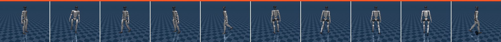

# locomotion_ros2_gait_lab_sil

A software-in-the-loop locomotion_ros2 adapter that drives a **MuJoCo Unitree G1**
through a [`gait_lab`](../../../experiments/gait_lab) controller — by default the
reinforcement-learned **`rl-residual`** policy, the only gait_lab gait that walks
a full horizon. It closes the *experiment → product* loop: a gait validated
offline in `gait_lab` now runs as a live simulated robot **behind the real
runtime and safety pipeline**, driven by the same `/cmd_vel` / action interfaces
as every other adapter.



*The gait this adapter runs: the reinforcement-learned `rl-residual` policy
walking the full 8 s horizon (left→right) — the only gait_lab gait that stays up
and travels (every model-based / hand-tuned gait is on the ground by ~3 s). It is
this gait, behind the runtime + safety pipeline, that `/cmd_vel` now drives.*

## How it fits together

The heavy physics and the learned policy are Python (MuJoCo). To keep MuJoCo an
optional dependency of *one node* and never of locomotion_ros2 itself, this package
splits into a thin C++ bridge inside the runtime and a companion Python sim:

```
runtime ─ safety pipeline ─► GaitLabSilAdapter (C++ plugin, this package)
                                  │  /gait_lab_sil/command_velocity (TwistStamped)
                                  │  /gait_lab_sil/control          (String lifecycle)
                                  ▼
                             gait_lab_sil_sim.py (rclpy + MuJoCo + gait_lab)
                                  │  /gait_lab_sil/robot_state      (WalkingState)
                                  ▲
                             read_state() ◄─ GaitLabSilAdapter
```

* **`GaitLabSilAdapter`** (C++, `locomotion_ros2_core::WalkingAdapter` pluginlib
  plugin) is a pure-ROS bridge — **no MuJoCo/Python build dependency**. It
  forwards the runtime's *safety-filtered* velocity and lifecycle transitions to
  the sim and reports the simulated robot's `WalkingState` back. It owns a small
  internal node, drained non-blockingly from `read_state()` via `spin_some` (no
  background thread). All gating / state-fusion logic lives in the ROS-free
  `GaitLabSilModel` (unit-tested).
* **`gait_lab_sil_sim.py`** (in `locomotion_ros2_examples/scripts`) runs the G1 in
  MuJoCo under the chosen gait_lab controller, steps physics at the policy's
  control rate, and publishes the resulting balance / walking / fall state.

Because it is software-in-the-loop, `get_status().allow_motion` is always
`false`: it drives a simulated robot, never hardware.

## Running it

The sim node needs a Python with `mujoco` + `gait_lab`'s deps (the adapter and
runtime do not). Then:

```bash
ros2 launch locomotion_ros2_bringup gait_lab_sil_runtime.launch.py \
    gait_lab_path:=/path/to/locomotion_ros2/experiments/gait_lab

# in another shell: drive it forward and watch it walk
ros2 topic pub -r 10 /cmd_vel geometry_msgs/msg/Twist '{linear: {x: 0.3}}'
ros2 topic echo /locomotion_ros2/state
```

Point at a menagerie G1 with `menagerie_path:=` (or `LOCOMOTION_ROS2_MENAGERIE_PATH`)
and choose a different gait_lab controller with `controller:=balanced-cpg`, etc.

### ros2_control split path (B3 first rung)

The default launch keeps physics and the gait_lab policy in one node
(`gait_lab_sil_sim.py`). The ros2_control path splits them so joint states and
commands flow through the in-repo `GaitLabSilTopicSystem` plugin and a
`joint_state_broadcaster` exposes standard `/joint_states`:

```bash
ros2 launch locomotion_ros2_bringup gait_lab_sil_ros2_control_runtime.launch.py \
    gait_lab_path:=/path/to/locomotion_ros2/experiments/gait_lab
```

* **Physics** — `gait_lab_sil_sim.py` with `ros2_control_split:=true`
* **Policy** — `gait_lab_sil_gait_controller.py` (swap with `controller:=…`)
* **ros2_control** — `g1_sil_ros2_control.urdf` +
  `locomotion_ros2_gait_lab_sil/GaitLabSilTopicSystem` + `joint_state_broadcaster`
* **B3 deep** — optional `GaitLabSilJointForwardController` plugin; enable with
  `use_ros2_control_forward:=true` on the ros2_control launch (default remains
  the direct `joint_commands` policy path).
* **B3 deep (embedded RL)** — `GaitLabSilRlResidualController` runs npz MLP
  inference in C++; enable with `use_embedded_rl_policy:=true` (Python node
  publishes CPG feedforward + observations only). Embedded launch uses
  `substeps:=1` lockstep so each MuJoCo step gets a fresh feedforward + paired
  residual (batched virtual ticks desynced the CPG from physics).
* **B2 (steerable)** — `controller:=rl-steerable` on the split stack; E2E
  `--steer` (B2 quantitative yaw gate) and `--steer-loose` (first rung) use the
  embedded relay path. `--steer-direct` exercises the Python policy path for
  comparison.

Verified by `tools/check_gait_lab_sil_ros2_control_e2e.py` (`--forward`,
`--embedded`, `--steer`, `--steer-direct`; needs MuJoCo) and
`tools/check_gait_lab_rl_policy_parity.py` (Python vs C++ MLP inference).

### Driving it from Nav2

The launch already includes the legged `cmd_vel_bridge`, so the robot is driven
by the same path Nav2 uses: a plain `/cmd_vel` Twist is shaped to the legged
velocity envelope, gated on the robot being ready (`/locomotion_ros2/state`), and fed
through the runtime's safety pipeline into the SIL adapter. So Nav2's controller
server (or teleop) drives the RL-gait G1 directly — publish to `/cmd_vel` and it
walks. `tools/check_gait_lab_sil_nav2_e2e.py` verifies this whole path
end-to-end.

## Tests

* `colcon test --packages-select locomotion_ros2_gait_lab_sil` runs the gtest for the
  ROS-free `GaitLabSilModel` (lifecycle gating, estop/clear-fault, sim-state
  freshness, state fusion).
* `tools/check_gait_lab_sil_e2e.py` is the end-to-end check: it brings up the
  runtime with this adapter + the MuJoCo sim, drives an `ExecuteVelocity` goal
  through the safety pipeline, and confirms the RL gait walks the full command
  without falling. Run it with an interpreter that has both `rclpy` and `mujoco`.
